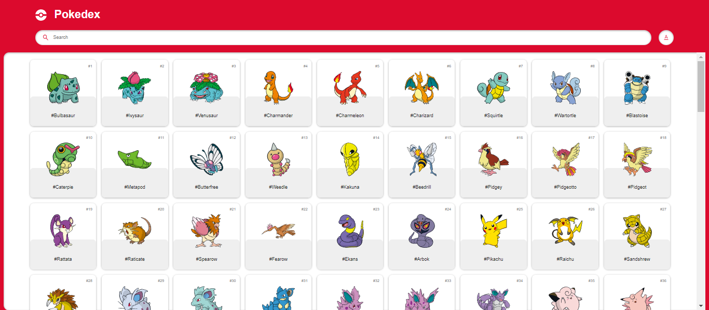

# Pokedex - Pokémon Information App



## Descripción

Este proyecto es una **Pokedex interactiva** que permite a los usuarios buscar y visualizar información detallada de diferentes Pokémon. Puedes explorar la información de cada Pokémon, incluyendo su número, nombre, tipo, peso, altura, habilidades y estadísticas base. La interfaz está diseñada para ser amigable y visualmente atractiva, brindando una experiencia de usuario fluida.

## Características

- **Búsqueda de Pokémon:** Encuentra cualquier Pokémon escribiendo su nombre o número.
- **Filtrado y Ordenamiento:** Ordena los Pokémon por nombre o número.
- **Vista Detallada:** Muestra las estadísticas y habilidades del Pokémon seleccionado.
- **Navegación Sencilla:** Interfaz intuitiva con elementos visuales como iconos y gráficos.

## Tecnologías Utilizadas

- **HTML:** Estructura del contenido de la página.
- **CSS:** Estilos y diseño visual de la aplicación.
- **JavaScript:** Lógica de la aplicación, manejo de eventos y actualización dinámica del contenido.

## Instalación

1. Clona este repositorio:
   ```bash
   git clone https://github.com/lucas29951/poke-api.git
2. Navega al directorio del proyecto:
   ```bash
   cd poke-api
3. Abre `index.html` en tu navegador web favorito.

## Uso

1. Usa la barra de búsqueda para encontrar un Pokémon por su nombre o número.
2. Filtra la lista de Pokémon por nombre o número usando el botón de ordenamiento.
3. Haz clic en cualquier Pokémon de la lista para ver sus detalles.

## Contribuciones

¡Las contribuciones son bienvenidas! Si tienes sugerencias o mejoras, siéntete libre de abrir un *issue* o enviar un *pull request*.

## Créditos

Este proyecto fue realizado basandose en el proyecto de [Ademir](https://github.com/Ade-mir). Agradezco al autor por compartir sus conocimientos y recursos.

Puedes encontrar el video de como realizarlo en el siguiente enlace: [Enlace del video](https://youtu.be/56VjdqcdakQ).


---

¡Gracias por visitar y contribuir!